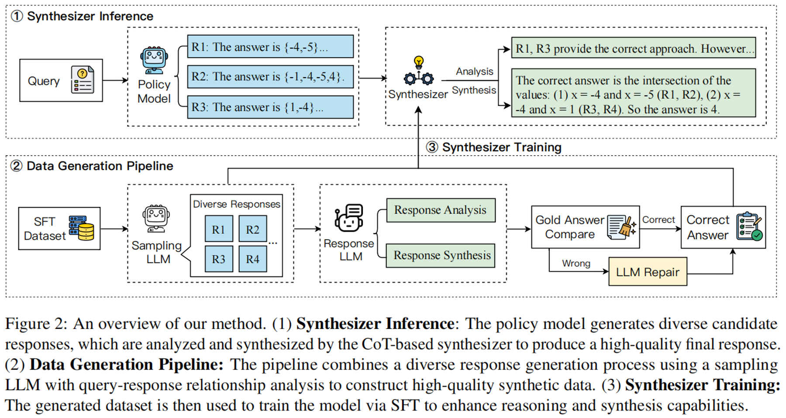

# CoT-based-Synthesizer

This repo is the official implementation of the paper "[CoT-based Synthesizer: Enhancing LLM Performance through Answer Synthesis](https://arxiv.org/abs/2501.01668)".

<p align="center">
  |<a href="https://arxiv.org/abs/2501.01668">[📄 arXiv]</a> |
<a href="https://huggingface.co/datasets/BoHanMint/Synthesizer-8B-math-train-data">[📊 Dataset]</a> |
<a href="https://huggingface.co/BoHanMint/Synthesizer-8B-math">[📦 Model]</a> |
</p>
<hr>

## Introduction

We present **CoT-based Synthesizer**, an innovative method that leverages CoT reasoning to integrate information from multiple responses, enabling the generation of a more accurate and refined synthesis response, even when all candidate responses are flawed. We also develop an automated data generation pipeline, which facilitates the training of smaller, cost-efficient models that can enhance the integration performance of larger models effectively.


## Experiment
We conduct experiments on mathematical reasoning and table question answering tasks, including four benchmarks: MATH, GSM8k, WikiTQ and FeTaQA. The evaluation result is shown below:

| Method                              | GLM-4-Plus | GPT-4o | Llama3.1-70B | Llama3.1-8B | Llama3-8B | Qwen2-7B | Qwen2.5-14B | Average |
|-------------------------------------|------------|--------|--------------|-------------|-----------|----------|-------------|---------|
| **GSM8k**                           |            |        |              |             |           |          |             |         |
| CoT-prompting                   | 88.6       | 91.4   | 92.7         | 81.9        | 73.4      | 82.0     | 91.2      | 85.9    |
| Self-consistency                              | 90.1       | 92.4   | <ins>93.9</ins>     | 85.1        | 80.9      | 84.3     | <ins>92.3</ins>   | 88.4    |
| Universal Self-consistency (Llama3.1-70B)               | 90.1       | 92.3   | 93.5         | 85.4        | 82.0      | 84.9     | <ins>92.3</ins>    | 88.6    |
| LMCOR(Llama3-8B)                | 88.9       | 90.4   | 90.1         | 83.1        | 79.4      | 84.8     | 89.5        | 86.6    |
| ArmoRM(Llama3-8B)               | 90.3       | 91.6   | 93.3         | 85.5        | <ins>82.4</ins>   | 86.1     | 92.1        | 88.8    |
| Scalar RM(Llama3-8B)            | 89.1       | 91.9   | 93.3         | 85.6        | 81.6      | 85.8     | 91.4        | 88.4    |
| Ours(Llama3.1-70B)                  | <ins>91.2</ins>    | <ins>92.6</ins> | 93.6         | **86.9**    | **83.5**  | **88.3** | <ins>92.3</ins>     | **89.8**|
| Ours(Synthesizer-8B)                     | **91.4**   | **93.0**| **94.0**     |<ins>86.1</ins>     | 81.3      | <ins>86.4</ins>  | **92.7**    | <ins>89.3</ins> |
**MATH**                            |            |        |              |             |           |          |             |         |
| CoT-prompting                   | 54.8       | 62.5   | 66.6         | 46.5        | 24.2      | 57.3     | 74.4        | 55.2    |
| Self-consistency                               | 63.0       | 68.7   | 68.8         | **55.4**    | 32.4      | 61.0     | 76.6        | 60.8    |
| Universal Self-consistency (Llama3.1-70B)               | 62.6       | 67.3   | 68.4         | 52.8        | 35.4      | 62.2     | <ins>78.2</ins>    | 61.0    |
| LMCOR(Llama3-8B)                | 52.4       | 61.2   | 57.6         | 44.8        | 33.6      | 51.6     | 64.0        | 52.2    |
| ArmoRM(Llama3-8B)               | 60.6       | 67.5   | <ins>69.4</ins>     | 52.6        | 32.8      | 60.2     | 77.2        | 60.0    |
| Scalar RM(Llama3-8B)            | 61.4       | 65.9   | 66.8         | 52.8        | 34.2      | 59.4     | 77.6        | 59.7    |
| Ours(Llama3.1-70B)                  | <ins>64.2</ins>   | **75.5**| **69.6**     | 52.8        | **38.8**  | **63.6** | **79.0**    | **63.4**|
| Ours(Synthesizer-8B)                | **64.4**   | <ins>72.9</ins> | **69.6**     | <ins>54.6</ins>   | <ins>36.0</ins>  | <ins>62.4</ins> | <ins>78.2</ins>    | <ins>62.6</ins> |
**WikiTQ**                          |            |        |              |             |           |          |             |         |
| CoT-prompting                   | 90.1       | 89.9   | 86.7         | 72.4        | 71.7      | 63.8     | 77.9        | 78.9    |
| Universal Self-consistency (Llama3.1-70B)               | 91.6       | **91.8**| **88.3**     | 79.6        | 76.3      | 69.2     | **81.5**    | 82.6    |
| LMCOR(Llama3-8B)                | 88.8       | 90.4   | 87.8         | 77.3        | 75.4      | 69.2     | 81.4        | 81.5    |
| ArmoRM(Llama3-8B)               | 91.0       | **91.8**| 87.5         | 77.9        | 73.8      | 69.4     | 81.2        | 81.8    |
| Scalar RM(Llama3-8B)            | **91.8**   | 90.5   | 87.5         | 77.6        | 74.9      | 69.8     | 80.1        | 81.7    |
| Ours(Llama3.1-70B)                  | <ins>91.9</ins>  | **92.3**| <ins>88.3</ins>     | **83.4**    | **82.2**  | **78.0** | **84.2**    | **85.8**|
| Ours(Synthesizer-8B)                     | **92.1**   | <ins>91.9</ins>| **88.9**     | <ins>79.9</ins>    | <ins>77.7</ins>  | <ins>72.2</ins> | <ins>82.4</ins>   | <ins>83.6</ins>|
**FeTaQA**                          |            |        |              |             |           |          |             |         |
| CoT-prompting                   | 86.4       | 86.3   | 85.6         | 82.6        | 82.2      | 73.5     | 82.7        | 82.8    |
| Universal Self-consistency (Llama3.1-70B)               | <ins>87.1</ins>   | <ins>87.0</ins>| 86.1         | **84.3**    | **83.9**  | **77.5** | **84.1**    | **84.3**|
| LMCOR(Llama3-8B)                | 86.0       | 84.7   | 83.0         | 84.7        | 83.8      | 79.9     | 83.2        | 83.6    |
| ArmoRM(Llama3-8B)               | **87.5**   | 86.1   | 86.0         | 83.2        | 82.5      | 76.1     | 82.9        | 83.5    |
| Scalar RM(Llama3-8B)            | **87.4**   | 85.5   | 85.3         | 83.0        | 82.3      | 75.1     | 83.3        | 83.1    |
| Ours(Llama3.1-70B)                  | **87.0**   | **86.8**| <ins>86.6</ins>    | **84.9**    | <ins>85.1</ins>  | **82.3** | <ins>84.1</ins>    | <ins>85.3</ins>|
| Ours(Synthesizer-8B)                     | **87.5**   | **87.9**| **87.5**     | <ins>84.7</ins>    | **85.9**  | <ins>82.1</ins> | **86.6**    | **86.0**|


## Dataset
We use four benchmarks for evaluation, you can obtain the original file of theses benchmarks in ```data``` folder. The detailed sources of these benchmarks are as follows:
- GSM8k: Same as the original [GSM8k test dataset](https://github.com/openai/grade-school-math).
- MATH: A subset of [MATH](https://github.com/hendrycks/math/), the same 500 samples from [PRM800K](https://github.com/openai/prm800k).
- WikiTQ: A subset of WikiTQ, the same 633 samples from [TableLLM](https://github.com/RUCKBReasoning/TableLLM).
- FeTaQA: A subset of FeTaQA, the same 753 samples from [TableLLM](https://github.com/RUCKBReasoning/TableLLM).


## Prompt Template
The prompt we used for generating synthesis answer is introduced below.

```
Please act as an excellent summarizer and summarize the following AI responses to the questions. Your summary should fully consider the connection between the question and AI responses, resulting in a correct, high-quality answer. In most cases, the same response that appears most often in the response may be the correct answer. If you find that there is no correct answer, please try to generate a correct answer yourself. Do not copy The candidate's answer, give your summarized answer and reasons, and give the correct answer at the end of the sentence in the format: The answer is...

[The Start of Original Question]
{question}
[The End of Original Question]

[The Start of AI Responses]
{responses}
[The End of AI Responses]
```


## Environment Setup
Run the following commands to setup your environment:

```
git clone https://github.com/RUCKBReasoning/CoT-based-Synthesizer
conda create --name synthesizer --yes python=3.11
pip install -r requirements.txt
```

For the evaluation of MATH, we refer to the evaluation of [DART-Math](https://github.com/hkust-nlp/dart-math), with the environment setup as follows:
```
git clone https://github.com/hkust-nlp/dart-math.git && cd dart-math
pip install -e "."
```

## Inference
The example commands of synthesizer inference (e.g., MATH) are shown below:
```
cd inference

python synthesis_infer.py --model_name <model_name> --input_file ../data/MATH/math_llama3-8b_ans.jsonl --dataset MATH --output_file math_llama3-8b_summary
```

## Evaluation

The python code in ```evaluation``` folder is used for reproducing evaluation results. You can run the following command (e.g., MATH) to reproduce the result:
```
cd evaluation

python eval_math_task.py --dataset MATH --input_file math_llama3-8b_summary --dataset_name MATH
```

## Data Pipeline
The python code in the ```pipeline```folder is designed for generating training data. We first use ```sampling.py``` script to generate candidate responses and then use ```synthesizer``` script to generate corresponding diverse synthesis answers. The filtered, correct responses are then utilized for training.

## Citation
If you find our paper helpful, please cite the original paper:
```
@misc{zhang2025cotbasedsynthesizerenhancingllm,
      title={CoT-based Synthesizer: Enhancing LLM Performance through Answer Synthesis}, 
      author={Bohan Zhang and Xiaokang Zhang and Jing Zhang and Jifan Yu and Sijia Luo and Jie Tang},
      year={2025},
      eprint={2501.01668},
      archivePrefix={arXiv},
      primaryClass={cs.CL},
      url={https://arxiv.org/abs/2501.01668}, 
}
```
## Contact

If you have any questions, we encourage you to either create Github issues or get in touch with us at <zbhmint@ruc.edu.cn>.
